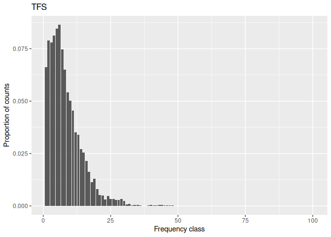
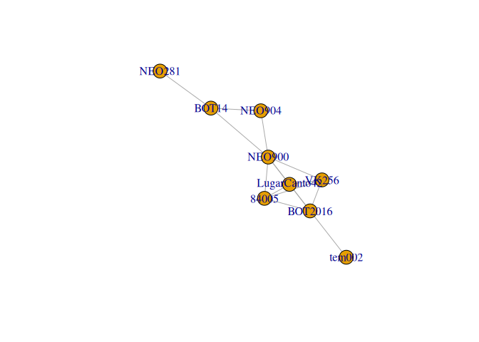
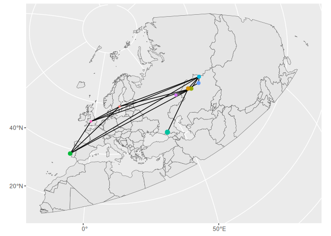

<!-- README.md is generated from README.Rmd. Please edit that file -->

# What is tractR?

The goal of *tractR* is simply to organize in a more organic way the
functions that I have implemented during my MSc thesis project:
[**Modeling the prehistory of early modern humans using markers of
Neanderthal
introgression**](https://github.com/fil-tel/MSc-thesis/blob/main/Master_s_thesis_FT.pdf).
Essentially, most of the functions are needed to encode introgressed
tracts table into binary matrices and summarize the information stored
into the binary matrices using statistics that we developed, such as the
Tract Frequency Spectrum (TFS). I decided to organize it into an R
package so to make it more reproducible and to ease the reuse of these
functions.

Here, you can find some basic examples on how to use these functions.

## Installation

You can install the development version of tractR from
[GitHub](https://github.com/) with:

``` r
# install.packages("pak")
devtools::install_github("fil-tel/tractR")
```

## Basic tutorial

Here I am going to show some examples.

``` r
suppressPackageStartupMessages({
  library(tractR)
  library(readr)
  library(dplyr)
  library(tidyr)
  library(magrittr)
  # These two are needed as all the functions to obtain
  # binary matrices depend on GenomicRanges
  library(GenomicRanges)
  library(plyranges)
})
```

## Brief description of my thesis

Briefly, during my MSc I explored several ways to use Neanderthal
introgressed tracts into the modern human genome as a source of
information to study both the interaction between modern humans and
Neanderthals and the prehistory of the first early modern humans that
left Africa. Given that the Neanderthals introgressed tracts we worked
with were stored in a tabular format, the first step was to encode them
into a more useful type of data structure. To do so, we came up with
four different approaches, described in my thesis, that lead to the
representation of the tracts as binary matrices. Here, starting from
both simulated and empirical tracts table I will show how to obtain the
binary matrices. NOTE: simulated and empirical need to be processed
using different functions, this because of the different nature of the
data (i.e. variable chromosomes length, number of chromosomes, etc.)

Examples of both simulated and empirical data can be found at
*inst/extdata*.

## Simulated data

``` r
# read the data
tracts_sim_df <- read_tsv(system.file("extdata", "model1_A_5000_rep1_tracts.tsv.gz", package = "tractR"))
#> Rows: 4065 Columns: 11
#> ── Column specification ────────────────────────────────────────────────────────
#> Delimiter: "\t"
#> chr (4): name, pop, source_pop, chrom
#> dbl (7): haplotype, time, left, right, length, source_pop_id, node_id
#> 
#> ℹ Use `spec()` to retrieve the full column specification for this data.
#> ℹ Specify the column types or set `show_col_types = FALSE` to quiet this message.
```

Look at the data.

``` r
head(tracts_sim_df)
#> # A tibble: 6 × 11
#>   name       haplotype  time pop   source_pop   left  right length source_pop_id
#>   <chr>          <dbl> <dbl> <chr> <chr>       <dbl>  <dbl>  <dbl>         <dbl>
#> 1 EUR_1_hap…         1     0 EUR   NEA        2.66e6 2.73e6  66709             2
#> 2 EUR_1_hap…         1     0 EUR   NEA        5.48e6 5.48e6   6480             2
#> 3 EUR_1_hap…         1     0 EUR   NEA        6.35e6 6.49e6 137295             2
#> 4 EUR_1_hap…         1     0 EUR   NEA        6.73e6 6.78e6  43207             2
#> 5 EUR_1_hap…         1     0 EUR   NEA        8.79e6 8.91e6 122470             2
#> 6 EUR_1_hap…         1     0 EUR   NEA        1.06e7 1.07e7  32481             2
#> # ℹ 2 more variables: node_id <dbl>, chrom <chr>
glimpse(tracts_sim_df)
#> Rows: 4,065
#> Columns: 11
#> $ name          <chr> "EUR_1_hap_1", "EUR_1_hap_1", "EUR_1_hap_1", "EUR_1_hap_…
#> $ haplotype     <dbl> 1, 1, 1, 1, 1, 1, 1, 1, 1, 1, 1, 1, 1, 1, 1, 1, 1, 1, 1,…
#> $ time          <dbl> 0, 0, 0, 0, 0, 0, 0, 0, 0, 0, 0, 0, 0, 0, 0, 0, 0, 0, 0,…
#> $ pop           <chr> "EUR", "EUR", "EUR", "EUR", "EUR", "EUR", "EUR", "EUR", …
#> $ source_pop    <chr> "NEA", "NEA", "NEA", "NEA", "NEA", "NEA", "NEA", "NEA", …
#> $ left          <dbl> 2664518, 5477136, 6352886, 6733894, 8791753, 10627582, 1…
#> $ right         <dbl> 2731227, 5483616, 6490181, 6777101, 8914223, 10660063, 1…
#> $ length        <dbl> 66709, 6480, 137295, 43207, 122470, 32481, 90379, 10911,…
#> $ source_pop_id <dbl> 2, 2, 2, 2, 2, 2, 2, 2, 2, 2, 2, 2, 2, 2, 2, 2, 2, 2, 2,…
#> $ node_id       <dbl> 14, 14, 14, 14, 14, 14, 14, 14, 14, 14, 14, 14, 14, 14, …
#> $ chrom         <chr> "chr1", "chr1", "chr1", "chr1", "chr1", "chr1", "chr1", …
```

To standardize the whole process, the tracts dataframe needs to be
conveted into GRanges objects in order to obtain a binary matrix.

``` r
# NOTE that I add a column "chrom" just for simplicity as usually the tracts in slendr do not have it since by default the genome has only one chromosome
# NOTE: it is important that the column with the ID of the individual is called "name" 

tracts_sim_df$chrom <- "chr1"

tracts_sim_gr <- tracts_sim_df %>% makeGRangesFromDataFrame(keep.extra.columns = TRUE, seqnames.field = "chrom", start.field = "left", end.field = "right")
```

At this point to get the binary matrix it is enough to pass the tracts
in its GRanges object form to the corresponding function
*get_bin_mat_APPROACHNAME_sim*.

## Uniqueness approach

Brief remind of the approach:

Each row of the matrix corresponds to a unique tract.

``` r
bin_mat_unique_sim <- get_bin_mat_unique_sim(tracts_sim_gr)
bin_mat_unique_sim[1:5, 1:5]
#>                      EUR_1_hap_1 EUR_1_hap_2 EUR_2_hap_1 EUR_2_hap_2
#> chr1:2664518-2731227           1           0           0           0
#> chr1:5477136-5483616           1           1           0           0
#> chr1:6352886-6490181           1           1           0           0
#> chr1:6733894-6777101           1           1           1           0
#> chr1:8791753-8914223           1           0           1           0
#>                      EUR_3_hap_1
#> chr1:2664518-2731227           0
#> chr1:5477136-5483616           0
#> chr1:6352886-6490181           0
#> chr1:6733894-6777101           0
#> chr1:8791753-8914223           0
```

## Windows approach

Brief remind of the approach:

The boundaries of the bins are defined by a window and step size.

``` r
# note that I am specifying the length of the simulated chromosome, size of the windows and the step size of the binning
# The warning is due to incongruences with the starting indexing of the bins (0 and 1)
bin_mat_wind_sim <- get_bin_mat_windows_sim(tracts_sim_gr, len_chr = 100e6, window_size = 50e3, step_size = 50e3)
#> Warning in valid.GenomicRanges.seqinfo(x, suggest.trim = TRUE): GRanges object contains 1 out-of-bound range located on sequence chr1.
#>   Note that ranges located on a sequence whose length is unknown (NA) or
#>   on a circular sequence are not considered out-of-bound (use
#>   seqlengths() and isCircular() to get the lengths and circularity flags
#>   of the underlying sequences). You can use trim() to trim these ranges.
#>   See ?`trim,GenomicRanges-method` for more information.
#> Warning in valid.GenomicRanges.seqinfo(x, suggest.trim = TRUE): GRanges object contains 1 out-of-bound range located on sequence chr1.
#>   Note that ranges located on a sequence whose length is unknown (NA) or
#>   on a circular sequence are not considered out-of-bound (use
#>   seqlengths() and isCircular() to get the lengths and circularity flags
#>   of the underlying sequences). You can use trim() to trim these ranges.
#>   See ?`trim,GenomicRanges-method` for more information.
#> Warning in valid.GenomicRanges.seqinfo(x, suggest.trim = TRUE): GRanges object contains 1 out-of-bound range located on sequence chr1.
#>   Note that ranges located on a sequence whose length is unknown (NA) or
#>   on a circular sequence are not considered out-of-bound (use
#>   seqlengths() and isCircular() to get the lengths and circularity flags
#>   of the underlying sequences). You can use trim() to trim these ranges.
#>   See ?`trim,GenomicRanges-method` for more information.
#> Warning in valid.GenomicRanges.seqinfo(x, suggest.trim = TRUE): GRanges object contains 1 out-of-bound range located on sequence chr1.
#>   Note that ranges located on a sequence whose length is unknown (NA) or
#>   on a circular sequence are not considered out-of-bound (use
#>   seqlengths() and isCircular() to get the lengths and circularity flags
#>   of the underlying sequences). You can use trim() to trim these ranges.
#>   See ?`trim,GenomicRanges-method` for more information.
bin_mat_wind_sim[1:5, 1:5]
#>                    EUR_1_hap_1 EUR_1_hap_2 EUR_2_hap_1 EUR_2_hap_2 EUR_3_hap_1
#> chr1:1-50000                 0           0           0           0           0
#> chr1:50001-100000            0           0           0           0           0
#> chr1:100001-150000           0           0           0           0           0
#> chr1:150001-200000           0           0           0           0           0
#> chr1:200001-250000           0           0           0           0           0
```

## Subtracts approach

Brief remind of the approach:

The boundaries of the bins are defined by the set of recombination
sites.

``` r
bin_mat_subtracts_sim <- get_bin_mat_subtracts_sim(tracts_sim_gr)
bin_mat_subtracts_sim[1:5, 1:5]
#>                    EUR_1_hap_1 EUR_1_hap_2 EUR_2_hap_1 EUR_2_hap_2 EUR_3_hap_1
#> chr1:0-45104                 0           0           0           0           0
#> chr1:45104-121225            0           0           0           0           0
#> chr1:121225-134375           0           0           0           0           0
#> chr1:158848-187501           0           0           0           0           0
#> chr1:187501-225293           0           0           0           0           0
```

## Recombination breakpoint approach

Brief remind of the approach:

Each row of the matrix corresponds to a recombination breakpoint
position.

``` r
bin_mat_site_sim <- get_bin_mat_sites_sim(tracts_sim_gr)
bin_mat_site_sim[1:5, 1:5]
#>             EUR_1_hap_1 EUR_1_hap_2 EUR_2_hap_1 EUR_2_hap_2 EUR_3_hap_1
#> chr1:0                0           0           0           0           0
#> chr1:45104            0           0           0           0           0
#> chr1:121225           0           0           0           0           0
#> chr1:134375           0           0           0           0           0
#> chr1:158848           0           0           0           0           0
```

## Empirical data

``` r
# read the data
tracts_emp_df <- read_tsv(system.file("extdata", "Vindija33.19_raw_eurasian_wModern_filtered", package = "tractR"))
#> Rows: 44023 Columns: 6
#> ── Column specification ────────────────────────────────────────────────────────
#> Delimiter: "\t"
#> chr (3): ID, chrom, set
#> dbl (3): start, end, length
#> 
#> ℹ Use `spec()` to retrieve the full column specification for this data.
#> ℹ Specify the column types or set `show_col_types = FALSE` to quiet this message.
```

Look at the data.

``` r
head(tracts_emp_df)
#> # A tibble: 6 × 6
#>   ID    chrom     start       end length set    
#>   <chr> <chr>     <dbl>     <dbl>  <dbl> <chr>  
#> 1 84005 chr4  102131955 102205398  73443 Ancient
#> 2 84005 chr10   3730051   3788850  58799 Ancient
#> 3 84005 chr1   79659418  79830100 170682 Ancient
#> 4 84005 chr18  62347905  62424274  76369 Ancient
#> 5 84005 chr10   5084852   5357328 272476 Ancient
#> 6 84005 chr4   82386470  82521768 135298 Ancient
glimpse(tracts_emp_df)
#> Rows: 44,023
#> Columns: 6
#> $ ID     <chr> "84005", "84005", "84005", "84005", "84005", "84005", "84005", …
#> $ chrom  <chr> "chr4", "chr10", "chr1", "chr18", "chr10", "chr4", "chr10", "ch…
#> $ start  <dbl> 102131955, 3730051, 79659418, 62347905, 5084852, 82386470, 1899…
#> $ end    <dbl> 102205398, 3788850, 79830100, 62424274, 5357328, 82521768, 1923…
#> $ length <dbl> 73443, 58799, 170682, 76369, 272476, 135298, 232971, 118449, 15…
#> $ set    <chr> "Ancient", "Ancient", "Ancient", "Ancient", "Ancient", "Ancient…
```

``` r
# NOTE: it is important that the column with the ID it is called name 
tracts_emp_df <- tracts_emp_df %>% rename(ID="name")
tracts_emp_gr <- tracts_emp_df %>% makeGRangesFromDataFrame(keep.extra.columns = TRUE)
```

At this point to get the binary matrix it is enough to pass the tracts
in its GRanges object form to the corresponding function
*get_bin_mat_APPROACHNAME_emp*.

## Uniqueness approach

Brief remind of the approach: Each row of the matrix corresponds to a
unique tract.

``` r
bin_mat_unique_emp <- get_bin_mat_unique_emp(tracts_emp_gr)
bin_mat_unique_emp[1:5, 1:5]
#>                          84005 Bar31 Bon004 BOT14 BOT2016
#> chr4:102131955-102205398     1     0      0     0       0
#> chr10:3730051-3788850        1     0      0     0       0
#> chr1:79659418-79830100       1     0      0     0       0
#> chr18:62347905-62424274      1     0      0     0       0
#> chr10:5084852-5357328        1     0      0     0       0
```

## Windows approach

Brief remind of the approach:

The boundaries of the bins are defined by a window and step size.

``` r
# note that I am specifying the size of the windows and the step size of the binning
bin_mat_wind_emp <- get_bin_mat_windows_emp(tracts_emp_gr, window_size = 50e3, step_size = 50e3)
bin_mat_wind_emp[1:5, 1:5]
#>                      84005 Bar31 Bon004 BOT14 BOT2016
#> chr1:2350001-2400000     0     0      0     0       0
#> chr1:2400001-2450000     0     0      0     0       0
#> chr1:2450001-2500000     0     0      0     0       0
#> chr1:2500001-2550000     0     0      0     0       0
#> chr1:2550001-2600000     0     0      0     0       0
```

## Subtracts approach

Brief remind of the approach: The boundaries of the bins are defined by
the set of recombination sites.

``` r
bin_mat_subtracts_emp <- get_bin_mat_subtracts_emp(tracts_emp_gr)
bin_mat_subtracts_emp[1:5, 1:5]
#>                    84005 Bar31 Bon004 BOT14 BOT2016
#> chr4:74508-77446       0     0      0     0       0
#> chr4:77446-109558      0     0      0     0       0
#> chr4:109558-201202     0     0      0     0       0
#> chr4:201202-317515     0     0      0     0       0
#> chr4:317515-319208     0     0      0     0       0
```

## Recombination breakpoint approach

Brief remind of the approach: Each row of the matrix corresponds to a
recombination breakpoint position.

``` r
bin_mat_site_emp <- get_bin_mat_sites_emp(tracts_emp_gr)
bin_mat_site_emp[1:5, 1:5]
#>             84005 Bar31 Bon004 BOT14 BOT2016
#> chr4:74508      0     0      0     0       0
#> chr4:77446      0     0      0     0       0
#> chr4:109558     0     0      0     0       0
#> chr4:201202     0     0      0     0       0
#> chr4:317515     0     0      0     0       0
```

# TFS

Here I show how to compute and visualize the Tract Frequency Spectrum
(TFS) given a binary matrix. Briefly, the TFS is simply a vector of
length equal to the number of sampled chromosome/individuals (this vary
depending on how the tracts are defined, e.g., IBDmix gives tracts per
individuals and not chromosomes, simulations give tracts per each
chromosome). I’ll use as an example the binary matrix for the subtracts
approach for the simulated dataset. In the simulated dataset I have 100
sampled individuals, each individual is diploid, so as a result I have
100 sampled chromosomes. Hence, the binary matrix has 100 columns. Note
that this is not always true if for some sampled individuals chromosomes
do not have any tracts.

``` r
ncol(bin_mat_subtracts_sim)
#> [1] 100
```

Now I compute the TFS fot his matrix using he function *compute_tfs*.

``` r
# Note that I specify the number of samples. In this case is equal to 100
tfs_vec <- compute_tfs(bin_mat_subtracts_sim, n_sample = 100)
# The vector store the proportion of counts per each bin of the histogram
tfs_vec
#>   [1] 0.0662286465 0.0788436268 0.0780551905 0.0812089356 0.0846254928
#>   [6] 0.0864651774 0.0746386334 0.0649145861 0.0541392904 0.0501971091
#>  [11] 0.0454664915 0.0352168200 0.0339027595 0.0270696452 0.0254927727
#>  [16] 0.0215505913 0.0162943495 0.0113009198 0.0128777924 0.0081471748
#>  [21] 0.0052562418 0.0049934297 0.0031537451 0.0047306176 0.0034165572
#>  [26] 0.0034165572 0.0028909330 0.0028909330 0.0034165572 0.0023653088
#>  [31] 0.0007884363 0.0010512484 0.0002628121 0.0005256242 0.0005256242
#>  [36] 0.0002628121 0.0000000000 0.0000000000 0.0002628121 0.0005256242
#>  [41] 0.0002628121 0.0002628121 0.0005256242 0.0005256242 0.0002628121
#>  [46] 0.0002628121 0.0002628121 0.0002628121 0.0000000000 0.0000000000
#>  [51] 0.0000000000 0.0000000000 0.0000000000 0.0000000000 0.0000000000
#>  [56] 0.0000000000 0.0000000000 0.0000000000 0.0000000000 0.0000000000
#>  [61] 0.0000000000 0.0000000000 0.0000000000 0.0000000000 0.0000000000
#>  [66] 0.0000000000 0.0000000000 0.0000000000 0.0000000000 0.0000000000
#>  [71] 0.0000000000 0.0000000000 0.0000000000 0.0000000000 0.0000000000
#>  [76] 0.0000000000 0.0000000000 0.0000000000 0.0000000000 0.0000000000
#>  [81] 0.0000000000 0.0000000000 0.0000000000 0.0000000000 0.0000000000
#>  [86] 0.0000000000 0.0000000000 0.0000000000 0.0000000000 0.0000000000
#>  [91] 0.0000000000 0.0000000000 0.0000000000 0.0000000000 0.0000000000
#>  [96] 0.0000000000 0.0000000000 0.0000000000 0.0000000000 0.0000000000

length(tfs_vec)
#> [1] 100
# 100
```

Now you can just visualize it.

``` r
library(ggplot2)
ggplot(data = data.frame(x=1:length(tfs_vec), y=tfs_vec))+geom_bar(mapping = aes(x=x, y=y), stat = "identity")+labs(x="Frequency class", y="Proportion of counts", title="TFS")
```



# Graph-based tract sharing data structure

Here, I present the functions to obtain the graph-based tract sharing
data structure introduced in my MSc thesis. Briefly, the idea is that
given a set of tracts intersecting a specific genomic regions we can
link these individuals using as information the sharing of recombination
breakpoints that belong to these tracts (Section 2.2.6 of the
[thesis](https://github.com/fil-tel/MSc-thesis/blob/main/Master_s_thesis_FT.pdf)).

In order to obtain the graph we first need to obtain an adjacency matrix
that tells us how the individuals/chromosomes carrying the tracts are
linked to each other. This can be done using the function *get_adjacency
matrix* and passing to the function the GRanges object storing the
tracts, a chromosome of interest, and a genomic position. Here is an
example:

``` r
adj_mat <- get_adj_mat(tracts_gr = tracts_emp_gr, chrom = "chr1", pos = 797e5)
adj_mat
#>              84005 BOT14 BOT2016 LugarCanto42 NEO281 NEO900 NEO904 tem002 VK256
#> 84005            0     0       1            1      0      1      0      0     1
#> BOT14            0     0       0            0      1      1      1      0     0
#> BOT2016          1     0       0            1      0      1      0      1     1
#> LugarCanto42     1     0       1            0      0      1      0      0     1
#> NEO281           0     1       0            0      0      0      0      0     0
#> NEO900           1     1       1            1      0      0      1      0     1
#> NEO904           0     1       0            0      0      1      0      0     0
#> tem002           0     0       1            0      0      0      0      0     0
#> VK256            1     0       1            1      0      1      0      0     0
```

The matrix is symmetric and the row and column names correspond to the
ID of the individuals carrying the tracts. Two individuals sharing one
recombination breakpoints will have an entry equal to 1, two individuals
sharing two rec breakpoints (i.e., they share the same tract) have an
entry equal to 2.

Obtained the adjacency matrix, we can easily build a graph using the R
package *igraph*.

``` r
library(igraph)
#> 
#> Attaching package: 'igraph'
#> The following object is masked from 'package:plyranges':
#> 
#>     groups
#> The following object is masked from 'package:GenomicRanges':
#> 
#>     union
#> The following object is masked from 'package:IRanges':
#> 
#>     union
#> The following object is masked from 'package:S4Vectors':
#> 
#>     union
#> The following objects are masked from 'package:BiocGenerics':
#> 
#>     normalize, path, union
#> The following object is masked from 'package:tidyr':
#> 
#>     crossing
#> The following objects are masked from 'package:dplyr':
#> 
#>     as_data_frame, groups, union
#> The following objects are masked from 'package:stats':
#> 
#>     decompose, spectrum
#> The following object is masked from 'package:base':
#> 
#>     union
graph <- graph_from_adjacency_matrix(adj_mat, mode="undirected")
```

``` r
plot(graph)
```



Given that empirical data carry information regarding space and time, if
we are interested in visualizing the graph in a geographical context we
can do so by using the *sf* and *sfnetworks* package. Here it is an
example for the grph above.

``` r
# First I load the metadata to obtain the geographical locations of the samples of the graph
metadata_raw <- read_tsv(file = system.file("extdata", "neo.impute.1000g.sampleInfo_clusterInfo.txt", package = "tractR"))
#> Rows: 4172 Columns: 32
#> ── Column specification ────────────────────────────────────────────────────────
#> Delimiter: "\t"
#> chr (22): sampleId, popId, site, country, region, groupLabel, groupAge, flag...
#> dbl (10): shapeA, latitude, longitude, age14C, ageHigh, ageLow, ageAverage, ...
#> 
#> ℹ Use `spec()` to retrieve the full column specification for this data.
#> ℹ Specify the column types or set `show_col_types = FALSE` to quiet this message.
# Filter only for the samples that are in adjacency matrix
metadata <- metadata_raw %>% filter(sampleId %in% colnames(adj_mat))
```

``` r
suppressPackageStartupMessages({
  library(sf)
library(sfnetworks)
library(igraph)
library(ggraph)
library(tidygraph)  
})

metadata_sf <- metadata %>% st_as_sf(coords = c("longitude", "latitude")) %>%  st_set_crs(4326) %>% st_jitter(amount = 2)

# get edges from graph
edge_df <- igraph::as_edgelist(graph) %>% as.data.frame()
colnames(edge_df) <- c("from", "to")

# What follows it is mainly copy pasted from the internet
# create sfnetworks
net <- sfnetworks::sfnetwork(nodes = metadata_sf, edges = edge_df, directed = FALSE, edges_as_lines = TRUE)
#> Checking if spatial network structure is valid...
#> Spatial network structure is valid

world <- rnaturalearth::ne_countries(scale = "medium", returnclass = "sf")
sf::st_agr(world) <- "constant"
# bbox <- st_as_sfc(st_bbox(c(xmin = -25, xmax = 120, ymin = 150, ymax = 150), crs = st_crs(world)))
# eurasia <- world %>% filter(continent %in% c("Europe", "Asia"))
bbox <- st_as_sfc(st_bbox(c(xmin = -20, xmax = 120, ymin = 10, ymax = 90), crs = st_crs(world)))
western_eurasia <- st_crop(st_make_valid(world), bbox)
# western_eurasia <- world
# western_eurasia <- world %>% filter(continent %in% c("Europe", "Asia"))

# activate nodes
net = net %>%
  activate("nodes") 
# net <- tidygraph::convert(
#   net, 
#   to_spatial_explicit, 
#   .clean = TRUE
# )

edge_df <- as_data_frame(net, what = "edges")

edge_df <- edge_df %>%
  mutate(pair = paste0(pmin(from, to), "_", pmax(from, to))) %>%
  add_count(pair, name = "pair_count") %>%  
  mutate(is_identical = ifelse(pair_count > 1, "Yes", "No"))

net <- net %>%
  activate("edges") %>%
  mutate(
    pair = edge_df$pair,
    pair_count = edge_df$pair_count,
    is_identical = edge_df$is_identical
  )


p <- ggplot() +
  geom_sf(data = western_eurasia) +
  geom_sf(data = st_as_sf(net, "edges"),
          mapping = aes(linetype = is_identical)) +
  geom_sf(data = metadata_sf,
          mapping = aes(color = sampleId, size = ageAverage)) +
  guides(color = guide_legend(title =
                                "Sample ID"),
         linetype = guide_legend(title = "Identical tract")) +
  coord_sf(crs = 3035) +   scale_size_continuous(name = "Sample age", range = c(1, 3))+
  theme(legend.position="none")

p
```


